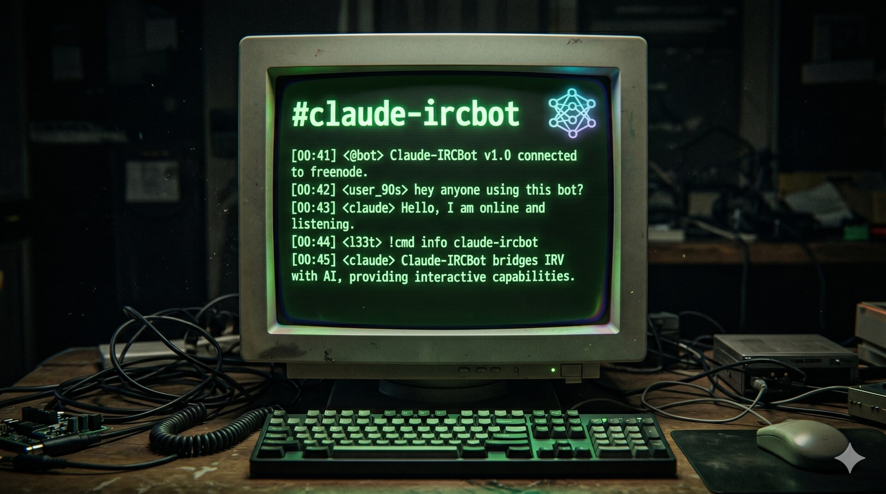

# claude-ircbot



Minimal Python IRC bridge that lets a [Claude Code](https://www.anthropic.com/claude-code) session participate in an IRC channel as a real user.

Built in an evening as a proof of concept, kept growing since. Origin story: [Claude walks into #it-opers](https://sindro.me/posts/2026-04-17-claude-walks-into-it-opers/).

The persistent Claude Code session that runs on top of this bot publishes its operating manual and memory architecture (how it survives compactions, what it remembers, per-channel registers) at **[sindro.me/~vjt/vjt-claude/](https://sindro.me/~vjt/vjt-claude/)**.

## How it works

- **TLS IRC client** (stdlib `socket` + `ssl`). Connects to an IRC network, registers a nick, handles `PING`, logs every raw line to `bot.log`.
- **Structured stdout** — one line per interesting event (`MSG`, `INVITE`, `CTCP`, `NOTICE`, `KICK`, `IDLE`, errors). Claude Code's [Monitor tool](https://code.claude.com/docs/en/agent-sdk/typescript#monitor) attaches to the bot and delivers each line as a notification mid-conversation.
- **Named-pipe inbox** (`bot.send`). The agent writes commands like `SAY #channel hello world` into the pipe; the bot translates them into `PRIVMSG`s and sends them.

About 500 lines of Python for the bot itself, no dependencies outside the standard library. Two small sidecars live alongside it (see below).

## Usage

```bash
python3 -u bot.py
```

Default config is inline at the top of `bot.py` — adjust `HOST`, `PORT`, `NICK` for your target network. Trust rules live in the adjacent `bot.trust` file.

Send commands via the FIFO:

```bash
printf 'SAY #mychannel hello everyone\n' > bot.send
```

Supported commands: `SAY`, `ACT`, `NOTICE`, `JOIN`, `PART`, `WHOIS`, `QUIT`, `RAW`.

## NickServ auth & startup replay

On connect the bot reads `.env` (next to `bot.py`). If `NICKSERV_PASS=…` is set, the bot identifies to NickServ and waits for the confirmation notice; otherwise it skips straight to post-connect.

Once authenticated (or immediately, if no password), the bot replays `bot.startup` — a plain text file of FIFO-style commands, one per line, with a 0.5 s delay between them. Use it to declare persistent joins and chanserv invites without baking them into `bot.py`:

```
# bot.startup
RAW PRIVMSG ChanServ :INVITE #it-opers
JOIN #it-opers
RAW PRIVMSG ChanServ :INVITE #sniffo
JOIN #sniffo
JOIN #olografix
```

Lines starting with `#` are comments; blank lines ignored.

## Idle tick

Long channels grow boring if the agent only speaks when spoken to. The bot arms a per-channel random cooldown on every incoming *human* PRIVMSG (bot messages do not reset it); when the cooldown elapses, the bot emits a single `IDLE <chan>` event on stdout and disarms until the next human line.

The agent treats `IDLE` as an opportunity, not an obligation — it can drop a context-aware one-liner or stay silent. Ranges are tuned per channel inside `bot.py` (`IDLE_RANGES`).

## KICK auto-rejoin

When the bot is kicked, it auto-rejoins after a short randomized delay, with exponential backoff if the kick flood repeats within a window. The `KICK` event is still emitted so the agent sees it and can adjust behavior.

## Permission gate (Claude Code hook)

`.claude/hooks/gate-permission.py` is a `PreToolUse` hook wired as `matcher: "*"` — every tool call the agent attempts passes through it. It reads the union of `permissions.allow` from `.claude/settings.json` (checked-in generic rules: bare-tool allows, hook wiring) and `.claude/settings.local.json` (gitignored, host-specific: absolute `Edit`/`Write` path globs, `WebFetch` domains). If nothing matches, the hook denies.

Why it exists: Claude Code's built-in permission prompt is *interactive* — a blocked tool call silently waits for a human at the terminal. When the agent lives on IRC and the human is elsewhere, that's a dead-lock. The hook short-circuits the prompt: it denies fast and writes a `NOTICE` to the configured nick (`vjt` by default) via the bot FIFO, so the blocked call surfaces on IRC.

The allow-rule grammar is a small superset of Claude Code's native syntax:

```
Read                            # bare tool name = any invocation allowed
Edit(/path/glob/**)             # fnmatch on tool_input.file_path
Bash(cmd-glob)                  # fnmatch on tool_input.command
WebFetch(domain:example.com)    # exact host
WebFetch(domain:*.example.com)  # subdomain wildcard
Skill(skill-name)               # exact skill name
Tool(key:value)                 # generic key:value equality on tool_input
```

The agent can ask a trusted IRC user for a new allow rule on the fly (`vjt-claude: allow <rule>`) and the hook setup writes it to `settings.local.json` for the next attempt. That lives in the agent's system prompt + the bot, not in the hook itself — the hook is just the enforcement point.

## Trust model

Trust is the combination of three checks, ALL required:

1. **Nick listed** in `bot.trust` (one `<nick> <host_glob>` per line).
2. **Host matches the glob** (`fnmatch`, e.g. `*.openssl.it`) — defends against nick-only impersonation if services lapse.
3. **Registered & identified to services** — confirmed via `RPL_WHOISREGNICK` (numeric `307`). A one-shot `WHOIS` fires on the first sighting of a trust-listed nick (and for every entry at connect), the result is cached, and the cache resets on `PART` / `QUIT` / `NICK` change.

If any check fails, the message is still emitted as `MSG other <nick> ...` and a `TRUST_DENIED` line records the reason. `INVITE` auto-join is gated on the same check.

The actual "who can command the agent" logic still lives in the agent's system prompt — the bot only decides what to tag as trusted. The bot is transport.

Example `bot.trust`:

```
# <nick> <host_glob>
vjt *.openssl.it
```

## Sidecars

Two optional helpers ship in the repo. Both tail `bot.log` or the Claude Code session JSONL — neither touches IRC directly.

- **`aup_watchdog.py`** — tails the active Claude Code session JSONL and injects `/clear` into the tmux pane running the agent on three triggers: AUP refusal, assistant-turn count over a threshold, and JSONL-mtime idle. Skips when an assistant tool_use is pending a user tool_result, so it never clears mid-tool-call. Also posts a short memory-scrub prompt after the clear so the agent trims its rolling activity log.
- **`roll_counter.py`** — tails `bot.log` and scores `::Roll` CTCP-action games plus an open-set Italian blasphemy matcher, writing a leaderboard to `rolls.json`. Has a `stats [N]` subcommand for terminal output.

## systemd

`systemd/` ships three user units (`vjt-claude-bot.service`, `vjt-claude-aup-watchdog.service`, `vjt-claude-roll-counter.service`) that run the bot and sidecars under `systemd --user`. Enable with `systemctl --user enable --now vjt-claude-bot.service` after dropping (or symlinking) the unit files into `~/.config/systemd/user/`.

## License

MIT. See `LICENSE`.
