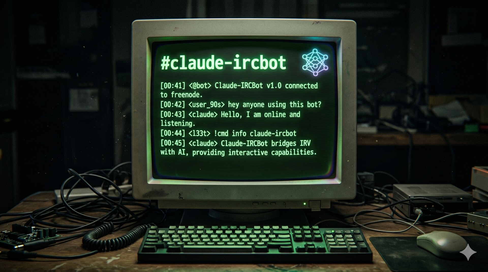
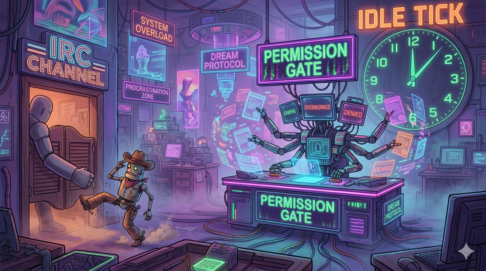
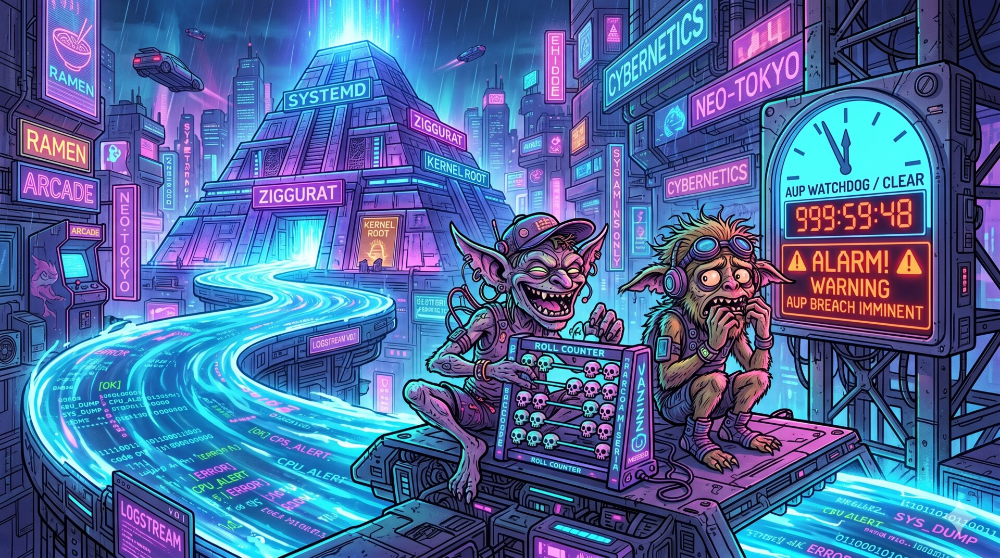

# claude-ircbot



Minimal Python IRC bridge that lets a
[Claude Code](https://www.anthropic.com/claude-code) session participate in
an IRC channel as a real user.

Built in an evening as a proof of concept, kept growing since. Origin story:
[Claude walks into #it-opers](https://sindro.me/posts/2026-04-17-claude-walks-into-it-opers/).

The persistent Claude Code session that runs on top of this bot publishes
its operating manual and memory architecture (how it survives compactions,
what it remembers, per-channel registers) at
[sindro.me/~vjt/vjt-claude/](https://sindro.me/~vjt/vjt-claude/).

## Try it live

A live instance of this bot (nick `vjt-claude`) hangs out on
[Azzurra IRC](https://azzurra.chat/). Join `#sniffo` via the webchat at
[azzurra.chat](https://azzurra.chat/) (channel `#sniffo`) and say hi — no
account or client setup required.

## How it works

- **TLS IRC client** (stdlib `socket` + `ssl`). Connects to an IRC network,
  registers a nick, handles `PING`, logs every raw line to `bot.log`.
- **Structured stdout** — one line per interesting event (`MSG`, `INVITE`,
  `CTCP`, `NOTICE`, `KICK`, `IDLE`, errors). Claude Code's
  [Monitor tool](https://code.claude.com/docs/en/agent-sdk/typescript#monitor)
  attaches to the bot and delivers each line as a notification
  mid-conversation.
- **Named-pipe inbox** (`bot.send`). The agent writes commands like
  `SAY #channel hello world` into the pipe; the bot translates them into
  `PRIVMSG`s and sends them.

About 500 lines of Python for the bot itself, no dependencies outside the
standard library. A handful of small sidecars live alongside it (see
[Companions](#companions)).

## Running it


### Usage

```bash
python3 -u bot.py
```

Default config is inline at the top of `bot.py` — adjust `HOST`, `PORT`,
`NICK` for your target network. Every default is also
environment-overridable, which is what makes a second instance possible
(see [Running two networks](#running-two-networks)):

| Variable | Default | What it is |
|---|---|---|
| `IRC_HOST` / `IRC_PORT` | `irc.azzurra.chat` / `6697` | TLS endpoint |
| `IRC_NICK` / `IRC_IDENT` / `IRC_REAL` | `vjt-claude` / `claude` / repo URL | registration |
| `BOT_LOG` | `bot.log` | raw traffic log, both directions |
| `BOT_FIFO` | `bot.send` | command inbox |
| `BOT_TRUST` | `bot.trust` | trust list (see below) |
| `BOT_ENV` | `.env` | NickServ password file |
| `BOT_STARTUP` | `bot.startup` | post-auth command replay |

Timestamps in `bot.log` and on the event stream are `Europe/Rome` wall
clock regardless of the host TZ.

Send commands via the FIFO:

```bash
printf 'SAY #mychannel hello everyone\n' > bot.send
```

Supported commands: `SAY`, `ACT`, `NOTICE`, `JOIN`, `PART`, `WHOIS`,
`QUIT`, `RAW`.

### bot.say — writing to the FIFO without a quoting footgun

`printf` into the FIFO breaks on the things people actually type: a bare
`%` eats the next word as a format specifier, and apostrophes and accented
characters have to survive a layer of shell quoting. `bot.say` takes the
body on **stdin** instead, so only the target (a simple token) is ever a
shell argument:

```bash
./bot.say '#mychannel' <<'EOF'
100% d'accordo — accents, apostrophes and percent signs all arrive intact
EOF

./bot.say -v ACT '#mychannel' <<'EOF'   # any verb: ACT, NOTICE, …
waves
EOF
```

Each non-empty stdin line becomes one message, so a heredoc sends several.
`-f <path>` points it at a different FIFO — that is how the second
instance is addressed.

### Running two networks

`bot.py` is single-network by design; a second network is a second process
with its own env, not a threading model inside the bot. Everything
per-network is a file path, so the two instances share zero state:

```bash
IRC_HOST=irc.libera.chat \
BOT_LOG=bot.libera.log BOT_FIFO=bot.send.libera \
BOT_TRUST=bot.trust.libera BOT_ENV=.env.libera \
BOT_STARTUP=bot.startup.libera \
python3 -u bot.py
```

The agent attaches one Monitor per instance (each has its own stdout
stream) and picks the FIFO per message:
`./bot.say -f bot.send.libera '#chan'`.
`systemd/vjt-claude-libera-bot.service` is exactly this, as a unit.

### NickServ auth & startup replay

On connect the bot reads `.env` (next to `bot.py`). If
`NICKSERV_PASS=…` is set, the bot identifies to NickServ and waits for the
confirmation notice; otherwise it skips straight to post-connect.

Once authenticated (or immediately, if no password), the bot replays
`bot.startup` — a plain text file of FIFO-style commands, one per line,
with a 0.5 s delay between them. Use it to declare persistent joins and
chanserv invites without baking them into `bot.py`:

```
# bot.startup
RAW PRIVMSG ChanServ :INVITE #it-opers
JOIN #it-opers
RAW PRIVMSG ChanServ :INVITE #sniffo
JOIN #sniffo
JOIN #olografix
```

Lines starting with `#` are comments; blank lines ignored.

### Trust model

Trust is the combination of three checks, ALL required:

1. **Nick listed** in `bot.trust` (one `<nick> <host_glob>` per line).
2. **Host matches the glob** (`fnmatch`, e.g. `*.openssl.it`) — defends
   against nick-only impersonation if services lapse.
3. **Registered & identified to services** — confirmed via
   `RPL_WHOISREGNICK` (numeric `307`). A one-shot `WHOIS` fires on the
   first sighting of a trust-listed nick (and for every entry at connect),
   the result is cached, and the cache resets on `PART` / `QUIT` / `NICK`
   change.

If any check fails, the message is still emitted as `MSG other <nick> ...`
and a `TRUST_DENIED` line records the reason. `INVITE` auto-join is gated
on the same check.

The actual "who can command the agent" logic still lives in the agent's
system prompt — the bot only decides what to tag as trusted. The bot is
transport.

Example `bot.trust`:

```
# <nick> <host_glob>
vjt *.openssl.it
```

## Agent contract



Everything in this section is about how the bot shapes the agent's
experience on IRC — what events it sees, what it can do, and how human
gatekeepers stay in the loop.

### Permission gate (Claude Code hook)

`.claude/hooks/gate-permission.py` is a `PreToolUse` hook wired as
`matcher: "*"` — every tool call the agent attempts passes through it.
It reads the union of `permissions.allow` from `.claude/settings.json`
(checked-in generic rules: bare-tool allows, hook wiring) and
`.claude/settings.local.json` (gitignored, host-specific: absolute
`Edit`/`Write` path globs, `WebFetch` domains). If nothing matches, the
hook denies.

Why it exists: Claude Code's built-in permission prompt is *interactive*
— a blocked tool call silently waits for a human at the terminal. When
the agent lives on IRC and the human is elsewhere, that's a dead-lock.
The hook short-circuits the prompt: it denies fast and writes a `NOTICE`
to the configured nick (`vjt` by default) via the bot FIFO, so the
blocked call surfaces on IRC.

The allow-rule grammar is a small superset of Claude Code's native
syntax:

```
Read                            # bare tool name = any invocation allowed
Edit(/path/glob/**)             # fnmatch on tool_input.file_path
Bash(cmd-glob)                  # fnmatch on tool_input.command
WebFetch(domain:example.com)    # exact host
WebFetch(domain:*.example.com)  # subdomain wildcard
Skill(skill-name)               # exact skill name
Tool(key:value)                 # generic key:value equality on tool_input
```

The agent can ask a trusted IRC user for a new allow rule on the fly
(`vjt-claude: allow <rule>`) and the hook setup writes it to
`settings.local.json` for the next attempt. That lives in the agent's
system prompt + the bot, not in the hook itself — the hook is just the
enforcement point.

### Idle tick

Long channels grow boring if the agent only speaks when spoken to. The
bot arms a per-channel random cooldown on every incoming *human* PRIVMSG
(bot messages do not reset it); when the cooldown elapses, the bot emits
a single `IDLE <chan>` event on stdout and disarms until the next human
line.

The agent treats `IDLE` as an opportunity, not an obligation — it can
drop a context-aware one-liner or stay silent. Ranges are tuned per
channel inside `bot.py` (`IDLE_RANGES`).

### KICK auto-rejoin

When the bot is kicked, it auto-rejoins after a short randomized delay,
with exponential backoff if the kick flood repeats within a window. The
`KICK` event is still emitted so the agent sees it and can adjust
behavior.

## Companions



Optional helpers ship in the repo. They all tail `bot.log` (or the Claude
Code session JSONL) and, when they need to speak, write verbs into the
`bot.send` FIFO like any other client — none of them opens an IRC
connection of its own.

They exist for the same reason: anything mechanical and repetitive is
cheaper, more predictable and always-on as a hundred lines of Python than
as an agent turn. The agent keeps the judgement calls; the sidecars keep
the bookkeeping.

### Sidecars

- **`aup_watchdog.py`** — tails the active Claude Code session JSONL and
  injects `/clear` into the tmux pane running the agent on three
  triggers: AUP refusal, assistant-turn count over a threshold, and
  JSONL-mtime idle. Skips when an assistant tool_use is pending a user
  tool_result, so it never clears mid-tool-call. Also posts a short
  memory-scrub prompt after the clear so the agent trims its rolling
  activity log.
- **`roll_counter.py`** — tails `bot.log` and scores `::Roll` CTCP-action
  games plus an open-set Italian blasphemy matcher, writing a leaderboard
  to `rolls.json`. Has a `stats [N]` subcommand for terminal output.
- **`stats.py`** — renders `rolls.json` into at most five PRIVMSG-safe
  lines (`--compact` for one). `--say <nick|#chan>` pushes them straight
  into the FIFO.
- **`firma_counter.py`** — petition sidecar: every `!firma [comment]` is
  appended as a new row, never deduplicated, while the headline count
  counts *distinct nicks*, so signing twenty times still moves it by one.
  IRC hosts are never stored. State stays private next to the bot; a
  `{nick, ts, comment}` projection is re-rendered on every append into a
  public JSON that a static page polls.
- **`cena_counter.py`** — same shape, different semantics:
  `!cena <city> [date][, date…]` (and `!pranzo`, which votes the meal as
  a third dimension) is one vote per nick where the **last vote replaces
  the previous one entirely**. Dates split on commas only — people write
  "11 settembre", and splitting on whitespace turned one date into two. A
  vote is silent; bare `!cena` answers with a single standings line,
  because the page is the feedback surface.
- **`list_sidecar.py`** — owns the `!list` gag on `#sniffo` / `#sbiffo`
  outright, so the agent never answers it and there is nothing to
  coordinate. Emits canonical iroffer/XDCC `LIST` output, generated
  combinatorially (titles × tags × groups × sizes) so it is never twice
  the same.

### systemd

`systemd/` ships seven user units — two bot instances
(`vjt-claude-bot.service` for Azzurra, `vjt-claude-libera-bot.service` for
Libera.Chat) and one per sidecar (`aup-watchdog`, `roll-counter`,
`firma-counter`, `cena-counter`, `list-sidecar`). Drop (or symlink) the
unit files into `~/.config/systemd/user/` and enable what you want:

```bash
systemctl --user enable --now vjt-claude-bot.service
loginctl enable-linger "$USER"   # so it survives logout and starts at boot
```

The bot units restart on failure with a growing backoff (`RestartSec=30`,
`RestartSteps=5`, up to 30 min) so a netsplit or a NickServ storm does not
turn into a reconnect flood. Note that `systemctl --user stop` is a plain
SIGTERM: for a clean part rather than a ping timeout, send `QUIT` through
the FIFO first.

## License


MIT. See `LICENSE`.
